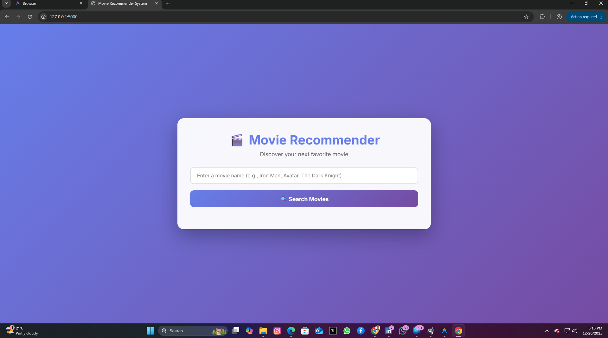
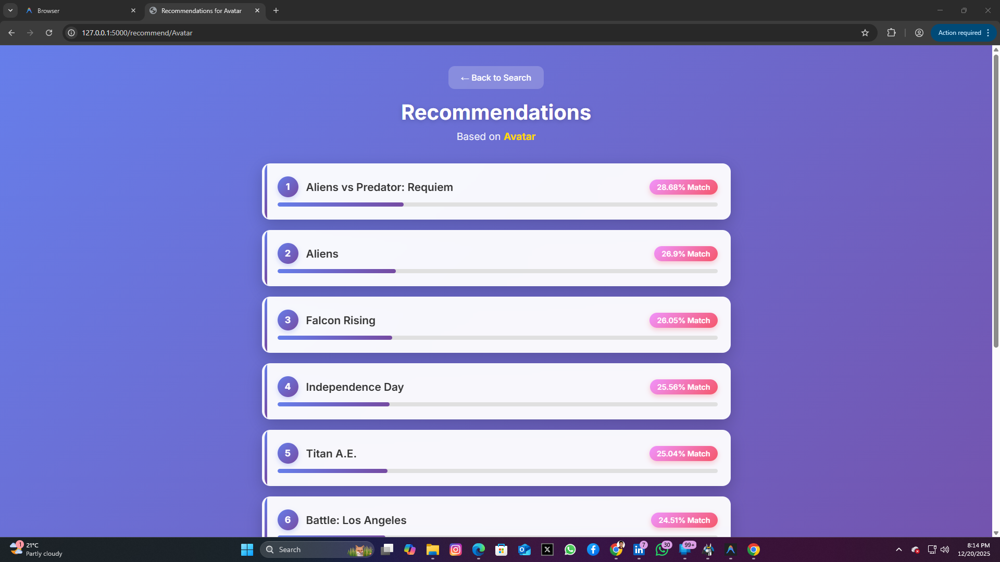

# 🎬 Movie Recommender System

A content-based movie recommendation system built with Flask and Machine Learning that suggests similar movies based on user preferences. The system uses cosine similarity and natural language processing to analyze movie metadata and provide personalized recommendations.


*Search for your favorite movies with intelligent autocomplete*


*Get personalized movie recommendations with similarity scores*

## 🌟 Features

- **Intelligent Search**: Fuzzy matching algorithm to find movies even with partial or misspelled names
- **Content-Based Filtering**: Recommendations based on movie genres, keywords, cast, crew, and plot overview
- **Interactive Web Interface**: Clean, modern UI built with Flask and responsive design
- **Autocomplete Suggestions**: Real-time movie suggestions as you type
- **Similarity Scoring**: Each recommendation comes with a similarity percentage
- **Large Movie Database**: Powered by TMDB 5000 Movie Dataset with comprehensive metadata

## 🛠️ Technology Stack

- **Backend**: Flask (Python Web Framework)
- **Machine Learning**: 
  - scikit-learn (Cosine Similarity, CountVectorizer)
  - NLTK (Natural Language Processing, Stemming)
- **Data Processing**: Pandas, NumPy
- **Frontend**: HTML, CSS, JavaScript
- **Dataset**: TMDB 5000 Movies Dataset

## 📊 How It Works

The recommendation system uses a **content-based filtering** approach:

1. **Data Preprocessing**: 
   - Extracts relevant features (genres, keywords, cast, crew, overview)
   - Combines features into a single "tag" for each movie
   - Applies text preprocessing (lowercasing, stemming)

2. **Vectorization**: 
   - Converts text tags into numerical vectors using CountVectorizer
   - Creates a 5000-feature vector space

3. **Similarity Calculation**: 
   - Computes cosine similarity between all movie vectors
   - Generates a similarity matrix for fast lookups

4. **Recommendation**: 
   - Finds the most similar movies based on cosine similarity scores
   - Returns top N recommendations with similarity percentages

## 📁 Project Structure

```
Movie-Recommender-System-Project/
├── app.py                      # Flask application with routes and recommendation logic
├── prepare_data.py             # Data preprocessing and model training script
├── requirements.txt            # Python dependencies
├── movies_dict.pkl            # Preprocessed movie data (generated)
├── similarity.pkl             # Similarity matrix (generated, ~176MB)
├── dataset/
│   ├── tmdb_5000_movies.csv   # Movie metadata
│   └── tmdb_5000_credits.csv  # Cast and crew information
├── templates/
│   ├── index.html             # Home page with search functionality
│   └── recommendations.html   # Recommendations display page
├── screenshot1.png            # Application screenshots
├── screenshot2.png
└── README.md                  # Project documentation
```

## 🚀 Getting Started

### Prerequisites

- Python 3.8 or higher
- pip (Python package manager)
- Git

### Installation

1. **Clone the repository**
   ```bash
   git clone https://github.com/pythonicshariful/Movie-Recommender-System-Project.git
   cd Movie-Recommender-System-Project
   ```

2. **Create a virtual environment** (recommended)
   ```bash
   python -m venv venv
   
   # On Windows
   venv\Scripts\activate
   
   # On macOS/Linux
   source venv/bin/activate
   ```

3. **Install dependencies**
   ```bash
   pip install -r requirements.txt
   ```

4. **Download NLTK data** (required for stemming)
   ```python
   python -c "import nltk; nltk.download('punkt')"
   ```

5. **Prepare the data** (if pickle files don't exist)
   ```bash
   python prepare_data.py
   ```
   This will process the movie datasets and create:
   - `movies_dict.pkl` (~2.2 MB)
   - `similarity.pkl` (~176 MB)
   
   ⚠️ **Note**: The similarity matrix generation may take several minutes depending on your system.

6. **Run the application**
   ```bash
   python app.py
   ```

7. **Access the application**
   
   Open your browser and navigate to: `http://localhost:5000`

## 💡 Usage

1. **Search for a Movie**: 
   - Enter a movie name in the search box
   - Use autocomplete suggestions for quick selection
   - Click on a movie from the search results

2. **View Recommendations**: 
   - See 10 similar movies with similarity scores
   - Each recommendation shows how closely it matches your selected movie
   - Click on any recommended movie to get its recommendations

3. **Explore**: 
   - Try different genres and movie types
   - Discover hidden gems similar to your favorites

## 📊 Dataset Information

The project uses the **TMDB 5000 Movie Dataset**, which includes:
- **4,800+ movies** with comprehensive metadata
- **Genres**: Action, Comedy, Drama, Thriller, etc.
- **Cast & Crew**: Top 3 actors and directors
- **Keywords**: Descriptive tags for each movie
- **Overview**: Plot summaries

**Dataset Source**: [TMDB 5000 Movie Dataset on Kaggle](https://www.kaggle.com/datasets/tmdb/tmdb-movie-metadata)

## 🔧 API Endpoints

| Endpoint | Method | Description |
|----------|--------|-------------|
| `/` | GET | Home page with search interface |
| `/search` | POST | Search for movies by name |
| `/recommend/<movie_title>` | GET | Get recommendations for a specific movie |
| `/api/autocomplete?q=<query>` | GET | Get autocomplete suggestions (JSON) |

## 🎯 Key Features Explained

### Fuzzy Matching
The system uses `difflib` for intelligent movie name matching, allowing users to find movies even with:
- Partial names (e.g., "Dark Knight" finds "The Dark Knight")
- Misspellings (e.g., "Inceptoin" finds "Inception")
- Case-insensitive search

### Content-Based Filtering
Unlike collaborative filtering, this system doesn't require user ratings. It recommends movies based on:
- **Genre similarity**: Action movies recommend other action movies
- **Cast overlap**: Movies with the same actors
- **Director style**: Films by the same director
- **Thematic keywords**: Similar plot elements and themes

### Stemming
Uses Porter Stemmer to normalize words:
- "running", "runs", "ran" → "run"
- Improves matching accuracy by focusing on word roots

## 🔮 Future Enhancements

- [ ] Add movie posters using TMDB API
- [ ] Implement user ratings and collaborative filtering
- [ ] Add movie details (release date, runtime, ratings)
- [ ] Create user accounts and watchlists
- [ ] Deploy to cloud platform (Heroku, AWS, or Render)
- [ ] Add filters (by genre, year, rating)
- [ ] Implement hybrid recommendation (content + collaborative)

## 🤝 Contributing

Contributions are welcome! Please feel free to submit a Pull Request.

1. Fork the repository
2. Create your feature branch (`git checkout -b feature/AmazingFeature`)
3. Commit your changes (`git commit -m 'Add some AmazingFeature'`)
4. Push to the branch (`git push origin feature/AmazingFeature`)
5. Open a Pull Request

## 📝 License

This project is open source and available under the [MIT License](LICENSE).

## 👨‍💻 Author

**Shariful Islam**
- GitHub: [@pythonicshariful](https://github.com/pythonicshariful)
- Project Link: [Movie Recommender System](https://github.com/pythonicshariful/Movie-Recommender-System-Project)

## 🙏 Acknowledgments

- [TMDB](https://www.themoviedb.org/) for the movie dataset
- [scikit-learn](https://scikit-learn.org/) for machine learning tools
- [Flask](https://flask.palletsprojects.com/) for the web framework
- The open-source community for inspiration and resources

---

⭐ **If you found this project helpful, please consider giving it a star!** ⭐